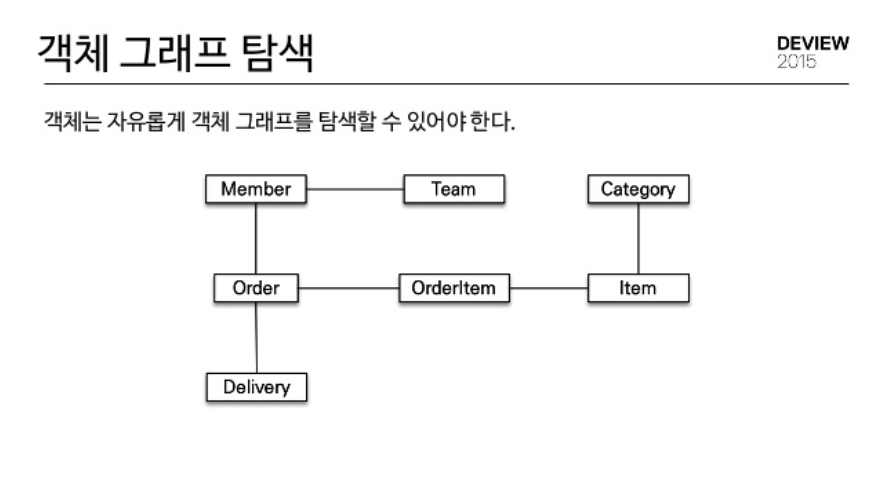

# Paging

## Paging이란?

▶️ 데이터의 양이 많은 경우 한 번에 모든 데이터를 표시하지 않고 페이지별로 나누어 보여주는 것

## Page

▶️ 데이터와 함께 페이징 정보 (전체 페이지 수, 전체 데이터 수 등)를 제공하는 인터페이스

- Pageable을 파라미터로 하여 가져온 결과물은 Page<Object> 형태로 반환

## Pageable

▶️ 페이징 정보 (페이지 번호, 페이지 크기, 정렬 방식 등)를 담고 있는 인터페이스

- JPA에서 제공하는 PageRequest 클래스를 통해 쉽게 인스턴스화 가능
- JPA에서 DB 쿼리에 쉽고 유연하게 limit 쿼리를 사용할 수 있게 해줌

## Page 객체의  구조

- Page 객체는 데이터를 리스트 형태로 가지고 있음 (해당 페이지에 표시될 데이터 목록)
- 주요 메서드
    - getContent() : 현재 페이지의 데이터 목록 반환
    - getTotalPages() : 전체 페이지 수를 반환
    - getTotalElements() : 전체 데이터 수를 반환
    - getNumber() : 현재 페이지 번호 반환
    - getSize() : 전체 데이터를 얼만큼씩 나눠 페이징 하는지 크기를 반환
    - getNumberOfElements() : 페이지에 존재하는 요소의 개수
    

---

# Slicing

## ▶️ JPA Pagination을 위한 객체로 Streamable을 상속받는 인터페이스

## Slice 특징

- 전체 데이터 개수를 조회하지 않고 이전 / 다음 slice가 존재하는지만 확인 가능
    
    → 무한 스크롤 구현에 유용
    

## Slice 메서드

- getContent() : 페이지 내용을 리스트로 반환
- getNumber() : 현재 페이지 번호 반환
- getNumberOfElements() : 현재 페이지의 데이터 개수 반환
- getSize() : 슬라이스의 size 반환
- hasContent() : 슬라이스에 데이터가 존재하는지 확인
- nextPageable() : 다음 Pageable을 반환

## Page 와의 차이

- Page는 전체 데이터 개수를 조회하기 때문에 Slice는 Page보다 쿼리가 하나 적게 날라간다
    
    → 데이터 양이 많을 수록 Slice를 사용하는 것이 성능상 유리함
    
- slice는 limit(size) + 1 된 값을 가져온다.
- slice는 전체 데이터가 중요하지 않고 현재 페이지와 다음 페이지가 중요함

---

# 객체 그래프 탐색

## ▶️ 참조 (reference)를 사용하여 연관된 객체를 찾는 것

## 객체지향 JAVA와 절차지향 SQL의 패러다임 불일치

- 상속
    
    객체 관계에서는 컬렉션을 사용하면 상속 관계에 대한 객체를 사용 가능하지만 DB는 객체를 분해하고 각 SQL을 생성해야 함
    
- 연관
    
    객체는 참조를 사용해 다른 객체와 연관관계를 갖기 때문에 단순히 참조에 접근해 연관된 객체를 조회
    
    테이블은 FK를 이용해 다른 테이블과 연관관계를 가지고 JOIN을 통해 연관 테이블 조회
    
    - 객체는 a→b 접근이 가능하지만 b→a 접근은 불가능
    - 테이블은 외래키만 있으면 양 테이블 접근이 가능
    
    → 이러한 차이를 개발자는 중간에서 변환을 통해 해결해야 함

-   
    
    객체의 경우는 상속과 연관 관계만 있으면 참조를 통해 Member에서 Category까지 접근 가능함
    
    DB의 경우는 Member에서 Category까지 접근하려면 5개의 테이블 JOIN이 필요
    

## ORM 및 JPA

- ORM (Object - Relation Mapping)
    - 객체와 RDB 사이에 존재하는 패러다임 불일치를 해소
    - 반복적인 CRUD SQL을 알아서 처리해주기 때문에 객체 모델링이 쉬움
- JPA는 연관된 객체를 사용하는 시점에 적절한 쿼리를 실행하기 때문에 실제 객체를 사용하는 시점까지 데이터베이스 조회를 미룰  수 있음 (Lazy Loading)